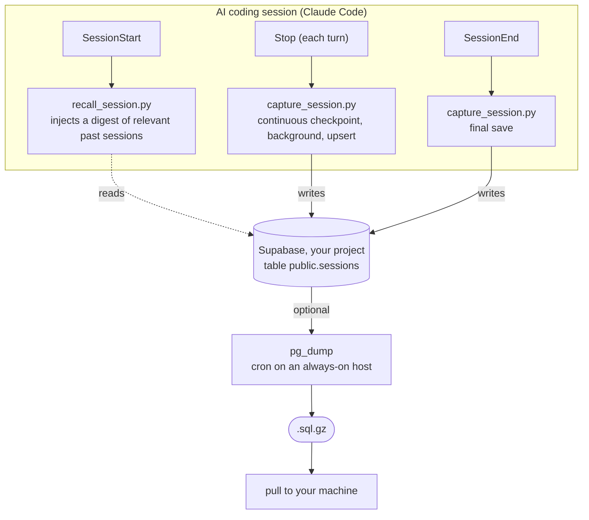

# agent-memory-hub

[](https://github.com/carloshpdoc/agent-memory-hub/actions/workflows/ci.yml)

> 🇧🇷 Leia em [Português](README.pt-br.md).


Persistent, **shared memory for AI coding agents** (Claude Code, and any MCP/REST-capable
tool), backed by **your own Supabase**. Every session is auto-saved to a Postgres table and
recalled at the start of the next one, across **sessions, tool instances, and machines**.

One stance sets it apart: **memory you can trust, explain, and own**. Not a black box.

- **Explainable.** Recall shows each item's provenance (a fact's confidence and age, a session's
  `session_id`), and a fact's confidence **decays with age**, so stale memory fades on its own.
- **Human-gated.** The cross-project developer profile and its rules are **proposed**, never
  applied on their own. You approve or reject; nothing silently rewrites how your agent works.
- **Yours.** Plain Postgres on your own Supabase. `pg_dump` anytime. No SaaS in the middle, no lock-in.

## Why

Claude Code starts every session from zero. Tools like claude-mem or mem0 solve this, but either
store locally (no cross-machine) or run through a hosted service, and most auto-apply whatever they
extract. `agent-memory-hub` is the self-owned, auditable take: a Supabase table you own, optional
layers you switch on as you need them (semantic search, facts, a cross-project developer profile,
backups), and a human in the loop wherever memory changes how the agent behaves.

- **Cross-session / instance / machine:** any setup pointing at the same Supabase shares everything.
- **Distilled, not dumped:** recall injects compact, ranked, explainable context, not raw transcripts.
- **Self-improving, on your terms:** it learns how you work across projects and proposes rules; you decide.

## vs. `CLAUDE.md` / `AGENTS.md`

They don't compete: `CLAUDE.md` (and Cursor's `AGENTS.md`) are **static instructions you
write by hand**; `agent-memory-hub` is **dynamic memory captured automatically**. One answers
*"how I want you to work"* (conventions, canonical commands, rules); the other answers *"what we
already did, decided, and broke before"* — episodic context that doesn't fit a hand-kept file
because it changes every session.

| | `CLAUDE.md` / `AGENTS.md` | `agent-memory-hub` |
|---|---|---|
| **Nature** | Static instructions, written by hand | Dynamic memory, captured automatically |
| **Source** | You type and maintain it | Generated from your real session history |
| **Kind of knowledge** | Rules ("always do it this way") | Episodic ("what happened / was decided / was fixed") |
| **Cross-session** | Reloads the same text every time | Recalls *specific* past sessions, on demand |
| **Cross-machine** | Only if you version the file | Automatic (shared Supabase) |
| **Evolves itself?** | No | Yes — captures, and proposes rules (you gate them) |
| **Upkeep** | You maintain it manually | Maintains itself |

**Where each wins.** `CLAUDE.md` is deterministic and versioned: a hand-written rule always
loads, identically, in every PR — right for commit conventions, build commands, module rules,
and anything that *must* be fixed. Memory is ranked and probabilistic, and shines where a static
file structurally can't: remembering automatically, across every session/machine/tool, auditably
and self-owned — so you stop re-explaining the project every session.

**They connect.** The two aren't rivals — the hub *feeds* `CLAUDE.md`. Its cross-project profile
watches your patterns, **proposes rules**, you approve, and they land in a `profile-rules.md`
your `CLAUDE.md` imports (`@~/.claude/profile-rules.md`). That's the loop that turns episodic
history into the static rules a `CLAUDE.md` holds — closing the gap between *what happened* and
*how to always work*. Use both: rules for what must be guaranteed, memory for everything you'd
otherwise forget.

## Features

- **Auto-capture** of every session, with a per-turn checkpoint that survives crashes.
- **Recall** at session start: a clean one-line summary per relevant session, plus the durable
  **facts** for the current project. Each item carries its **provenance** (facts: confidence and
  since-when; sessions: the `session_id`) so recall is explainable. Fact confidence **decays with
  age** (per-kind half-life), so stale facts fade from recall without being deleted.
- **Search** your whole history: **hybrid** (keyword + semantic via `pgvector`), with an
  optional LLM **`--rerank`** second pass.
- **Facts layer** (optional, bring-your-own-LLM): durable preferences / decisions / configs with
  temporal validity, deduped by meaning.
- **Developer profile** (optional): distills how you work *across all your projects* into a profile,
  and turns the patterns you approve into rules your agent follows. A self-improving loop, human-gated.
- **Cross-tool:** Claude Code via hooks, Codex CLI and Cursor via adapters, any tool via the adapter template.
- **MCP server** (`scripts/mcp_server.py`, pure stdlib): dedicated tools — `recall_relevant`,
  `recent_sessions`, `get_facts`, `get_session` — so any MCP agent (Claude Code, Cursor, Codex)
  queries the memory **on-demand, with the task in hand**, not just the passive recall at boot.
- **Memory console** (`scripts/memory.py`): browse, search and inspect from the terminal —
  `stats`, `recent`, `search`, `facts`, `show`, `profile`, plus `standup` (what you touched
  today/this week), `health` and `log` (below). Installable as a global `mem` command
  (`pipx install -e .`).
- **Health & observability** (`memory.py health` / `log`): reconciles local transcripts against
  Supabase and watches the capture error rate, so a **silent capture failure surfaces** instead
  of going unnoticed — memory you can *verify*, not just trust.
- **Weekly digest** (`scripts/weekly_digest.py`): a 7-day summary across all projects (LLM-free),
  with a hook into your content workflow.
- **Tested & measured:** an offline pytest suite + CI (on every push/PR) pin the capture pipeline
  so the silent-capture bugs can't return, and a recall eval harness (`scripts/eval_recall.py`,
  hit@k / MRR) means recall quality is *measured*, not assumed — that's how we confirmed a recency
  bias would hurt and kept the 1:1 hybrid fusion as the calibrated default.
- **Your own backups:** daily `pg_dump` to a portable `.sql`. No lock-in.
- **No LLM in the core** (the "semantic" part uses an embedded model, not a chat LLM); every
  LLM-powered piece is optional and has a free option.

## How it works



- Capture is **idempotent** (upsert by `session_id`). The `Stop` checkpoint means even an
  abrupt kill keeps the session up to its last turn.
- Recall injects only a **compact digest** (one extractive summary line per session, not raw
  transcript). Full transcripts stay queryable on demand via the Supabase MCP or REST.
- The summary is **deterministic and LLM-free**: the capture hook keeps the first substantive
  user ask, the last one, and turn counts. Run `sql/04-summary.sql` to add the column.

## Requirements and supported tools

The memory itself is just Postgres, so what's tool-specific is only the automatic
capture/recall, which ships as Claude Code hooks.

- **Auto-capture + recall (the hooks):** [Claude Code](https://claude.com/claude-code). The
  hooks use its `SessionStart`, `Stop`, and `SessionEnd` events.
- **Read and query the shared memory:** any MCP or REST capable AI tool, for example Cursor,
  Codex CLI, Gemini CLI, or ChatGPT, through the Supabase MCP or the REST API.
- **Capture from another tool:** an **adapter** scans that tool's local transcripts and uploads
  them. Codex CLI and Cursor ship as adapters (`scripts/adapters/`); see
  [Capture from other tools](#capture-from-other-tools-adapters) to add more.

Also needed:

- A free [Supabase](https://supabase.com) project.
- `python3` (hooks and backup are pure stdlib, no pip needed).

## Getting started (also: how to set it up on a machine)

> **Shortcut:** after cloning and filling `.env`, run `./scripts/setup.sh`. It applies the
> SQL migrations and installs the Claude Code hooks in one idempotent step (it does not enable
> the optional LLM facts layer). The manual steps below explain what it does.

### 1. Clone
```bash
git clone https://github.com/carloshpdoc/agent-memory-hub.git
cd agent-memory-hub
```

### 2. Create a Supabase project
At [supabase.com](https://supabase.com): new project. Enable **Data API** and **RLS**.
Grab from **Settings > API**: Project URL, publishable key, secret key.

### 3. Apply the schema
Open **SQL Editor** in Supabase and run [`sql/01-schema.sql`](sql/01-schema.sql).
It creates the `sessions` table, the full-text index, and RLS.

### 4. Configure `.env`
```bash
cp .env.example .env
# edit .env with your SUPABASE_URL and SUPABASE_SECRET_KEY (and backup vars if used)
```
`.env` is gitignored. The hooks read it directly.

### 5. Wire the hooks into Claude Code
Add to your Claude Code `settings.json` (`~/.claude/settings.json` for user scope), using the
**absolute path** to your clone:

```json
{
  "hooks": {
    "SessionStart": [
      { "matcher": "", "hooks": [
        { "type": "command", "command": "python3 /ABS/PATH/agent-memory-hub/hooks/recall_session.py", "timeout": 15 }
      ]}
    ],
    "Stop": [
      { "matcher": "", "hooks": [
        { "type": "command", "command": "payload=$(cat); printf '%s' \"$payload\" | python3 /ABS/PATH/agent-memory-hub/hooks/capture_session.py >/dev/null 2>&1 &" }
      ]}
    ],
    "SessionEnd": [
      { "matcher": "", "hooks": [
        { "type": "command", "command": "python3 /ABS/PATH/agent-memory-hub/hooks/capture_session.py", "timeout": 20 }
      ]}
    ]
  }
}
```
> If you already have hooks for these events, **add** these entries to the existing arrays.

### 6. (optional) Add the Supabase MCP
Lets the agent query memories interactively:
```bash
claude mcp add --scope user --transport http supabase \
  "https://mcp.supabase.com/mcp?project_ref=<YOUR_PROJECT_REF>"
# then authenticate: /mcp > supabase
```

### 7. (optional) Backup module
On an always-on host with `pg_dump` at or above your Postgres major version, and the repo cloned:
- Put your pooler creds in `~/.pgpass` (chmod 600):
  `HOST:5432:postgres:postgres.<PROJECT_REF>:PASSWORD`
- Fill the `PG_POOLER_*` vars in `.env`.
- Cron: `30 3 * * * /ABS/PATH/agent-memory-hub/scripts/backup.sh >> .../backup.log 2>&1`
- Pull copies locally with `scripts/pull-backups.sh` (set `REMOTE_SSH` and `SSH_KEY` in `.env`).

## Adding another machine

This is the whole point, and it's trivial:

1. Clone the repo on the new machine.
2. Copy the **same `.env`** (same Supabase credentials).
3. Run `./scripts/setup.sh`.

Done. That machine now writes to and reads from the **same shared memory**. The migrations are
idempotent (and skipped if it has no DB creds, since the schema is shared). The optional facts
layer stays off, so a weaker machine just captures and reads, while heavy fact extraction runs
only where you enable it.

To also upload that machine's **prior** Claude Code history (sessions from before the hooks),
run `python3 scripts/backfill_sessions.py --dry-run` to preview, then without the flag to upload.
It is idempotent (skips sessions already in Supabase).

## Capture from other tools (adapters)

The Claude Code hooks are one capture path. Tools without lifecycle hooks are handled by an
**adapter** that scans their local transcripts and uploads new ones (idempotent), the same way
`backfill_sessions.py` works for Claude Code. Adapters run on a cron and write with `tool=<name>`,
so recall, search and facts treat all tools uniformly.

- **Codex CLI** ([`scripts/adapters/codex.py`](scripts/adapters/codex.py)) reads
  `~/.codex/sessions/**/rollout-*.jsonl`. Run with `--dry-run` to preview, then put it on a cron.
- **Cursor** ([`scripts/adapters/cursor.py`](scripts/adapters/cursor.py)) reads Cursor's chat from
  its SQLite store (`.../Cursor/User/globalStorage/state.vscdb`), reconstructing each conversation
  from its message bubbles. A settle guard skips chats still in flight. `--dry-run` to preview;
  override the DB path with `CURSOR_DB=...` on another OS. Then put it on a cron.
- **Adding a tool:** write a small adapter that maps the tool's transcripts to
  `(session_id, cwd, user/assistant turns)` and upserts with `tool=<name>`. Use `codex.py` (JSONL)
  or `cursor.py` (SQLite) as the template. Gemini CLI is a good first contribution.

## Configuration reference

| Var | Used by | Meaning |
|-----|---------|---------|
| `SUPABASE_URL` | hooks, backup.py | `https://<ref>.supabase.co` |
| `SUPABASE_SECRET_KEY` | hooks | service_role key (writes, bypasses RLS) |
| `PG_POOLER_HOST`, `PG_POOLER_USER` | backup.sh | Session Pooler host, `postgres.<ref>` |
| `BACKUP_DIR`, `KEEP` | backup.sh, backup.py | output dir, how many to keep |
| `REMOTE_SSH`, `SSH_KEY` | pull-backups.sh | always-on host, SSH key |
| `EMBED_KEY` | embed_pending.py, search.py | guard for the embedding function (Phase 2) |

## Querying your memory

- **Console:** `python3 scripts/memory.py` opens an interactive prompt, or use it as
  subcommands: `stats`, `recent [N]`, `search [--project P] "<q>"`, `facts [project]`,
  `show <id-prefix>`, `standup [today|yesterday|week]`, `health`, `log [N]`. Pure stdlib,
  no server, no key in a browser. Either alias it
  (`alias mem='python3 /ABS/PATH/agent-memory-hub/scripts/memory.py'`) or install a real
  `mem` command from your clone: `pipx install -e .` (or `pip install -e .`). Editable keeps
  the files in the clone, so config and `mem health` resolve as usual; config is read from
  `$AGENT_MEMORY_HUB_ENV`, then `~/.config/agent-memory-hub/.env`, then the repo `.env`.
- **MCP server (dedicated):** `scripts/mcp_server.py` exposes `recall_relevant`, `recent_sessions`,
  `get_facts`, `get_session` over stdio/JSON-RPC (pure stdlib, no deps), so any agent queries the
  memory **on-demand with the task in context** — not only the passive recall at session start:
  ```bash
  claude mcp add --scope user agent-memory-hub -- python3 /ABS/PATH/agent-memory-hub/scripts/mcp_server.py
  ```
- **Supabase MCP:** ask the agent. It runs SQL via the Supabase MCP.
- **REST full-text:** `GET /rest/v1/sessions?content_tsv=fts(simple).<term>` with the secret key.
- **Filters:** by `project`, `machine`, `started_at`, `session_id`.

## Semantic search (Phase 2)

Optional. Adds meaning-based recall on top of full-text search, using `pgvector` and the
`gte-small` model running inside a Supabase Edge Function (free, no external API).

1. Run [`sql/02-phase2-pgvector.sql`](sql/02-phase2-pgvector.sql). It adds the `embedding`
   column, the HNSW index, and the `match_sessions` RPC. Also run
   [`sql/03-hybrid-search.sql`](sql/03-hybrid-search.sql) for the `hybrid_search` RPC.
2. Set a guard secret and deploy the function:
   ```bash
   supabase secrets set EMBED_KEY=$(openssl rand -hex 24)
   supabase functions deploy embed --no-verify-jwt   # new API keys are not JWTs
   ```
   Put the same `EMBED_KEY` in your `.env`.
3. Embed existing rows: `python3 scripts/embed_pending.py`. Run it on a cron to keep new
   sessions embedded (for example `*/15 * * * *` on your always-on host).
4. Search: `python3 scripts/search.py "how did we set up backups"`. It runs **hybrid search**
   (keyword + semantic, fused with Reciprocal Rank Fusion), so exact terms that pure vector
   search would miss still surface, and vice versa. Add `--rerank` for an optional LLM
   second pass that reorders the top candidates by relevance (needs `FACTS_LLM` set).

The Edge Function returns only vectors and counts, never session content.

## Recall eval (verify recall, don't just trust it)

The same stance the tool takes on capture, applied to recall itself: measure whether it
surfaces the right past context, don't assume it. [`scripts/eval_recall.py`](scripts/eval_recall.py)
runs the real recall path and scores it with **hit@k** and **MRR**.

```bash
python3 scripts/eval_recall.py --auto 30            # retrieval regression check
python3 scripts/eval_recall.py --auto 60 --spread   # representative, corpus-spread sample
python3 scripts/eval_recall.py --gold tests/eval/recall_gold.example.json
```

- **`--auto N`** samples N recent sessions, turns each session's own summary into a query, and
  checks whether that session comes back near the top. It won't prove recall is *smart*, but it
  screams when recall is *broken* (embeddings down, FTS misconfigured) — the silent failure this
  project exists to catch. Add **`--spread`** to sample across the whole corpus instead of the
  most recent (deterministic, reproducible) — that's the representative measurement mode.
- **`--gold FILE`** scores curated `{query, expect:{project?, contains?}}` cases (gold cases are
  your own; the shipped file is a format example).

Measured on the author's real corpus (267 sessions across 47 projects, hybrid recall,
`--auto 60 --spread`, Jul 2026):

| metric | score |
|---|---|
| hit@1 | 46.7% |
| hit@3 | 58.3% |
| hit@5 | 68.3% |
| MRR | 0.540 |

i.e. given only a one-line summary of a past session as the query, the exact session comes
back in the top 5 two times out of three, against 266 distractors. Your numbers will vary
with your corpus — the point is that you can *measure* yours with one command. (The harness
also killed a plausible "improvement": recency weighting, measured at −27 to −45 pp hit@1,
rejected. See `docs/00-design-decisions.md`.)

## Facts and preferences (optional, Phase 4)

Everything above needs **no LLM** (the "semantic" part uses the embedded `gte-small`, not a
chat model). This optional layer is the only part that uses an LLM, and it is
**bring-your-own-LLM with free options**, so it never forces a cost or a specific provider.

When enabled, an optional cron distills each session into durable atomic facts (preferences,
decisions, configs) with temporal validity, deduped by meaning. Recall then injects the
relevant facts (current project + global) at the top of the digest.

1. Run [`sql/05-facts.sql`](sql/05-facts.sql) (facts table, validity model, `match_facts` RPC).
2. Pick a provider in `.env` via `FACTS_LLM`:
   - `ollama`: local, free, private (needs Ollama running).
   - `gemini`: Google AI Studio free tier (`GEMINI_API_KEY`).
   - `openai`: OpenAI or any OpenAI-compatible endpoint (Groq, OpenRouter, local).
   - `off` (default): disabled; the rest of the tool is unaffected.
3. Run `python3 scripts/extract_facts.py` (put it on a cron to process new sessions).

**Deduping facts (optional, manual).** Over time, facts can overlap. `sql/06-find-fact-dupes.sql`
plus `scripts/consolidate_facts.py` let an LLM judge near-duplicate pairs and supersede the
redundant one (non-destructively, via `valid_until`). Run it with `--dry-run` and **review**:
this is deliberately not automated, because a weak judge can over-merge useful specifics, so a
human should approve. Some redundancy is fine; only prune what you've checked.

## Developer profile and self-improving rules (optional, Phase 9)

Most memory tools store facts *per project*. Because this hub holds every session across
**all** your projects, it can do something they can't: distill a profile of **how you work**
and turn the high-confidence patterns into rules your agent then follows. The loop is: the
more you use it, the better-tuned the agent's own instructions get, with you as the gate.


> _Illustrative run with generic data. The loop: synthesize a profile, review each pattern,
> approve, and the approved rules land in a file your `CLAUDE.md` imports._

1. Run [`sql/07-profile.sql`](sql/07-profile.sql) (the `profile_patterns` table).
2. With `FACTS_LLM` set (same providers as above), run `python3 scripts/synthesize_profile.py`.
   It reads your durable facts, keeps only patterns with evidence in **2+ different projects**,
   and writes a human-readable `PROFILE.md`. High-confidence patterns get a proposed rule.
3. Review with `python3 scripts/memory.py profile` and approve or reject each
   (`profile approve <id>` / `profile reject <id>`). Curation is deliberately human.
4. Run `python3 scripts/apply_profile_rules.py` (dry-run) then `--write`. It writes the
   approved rules to a **separate** file (`~/.claude/profile-rules.md`), never touching your
   hand-written `CLAUDE.md`. Load them once by adding `@~/.claude/profile-rules.md` to `CLAUDE.md`.
   - Add `--per-project` to instead write one file per project
     (`~/.claude/profile-rules/<project>.md`), each with the rules whose evidence includes that
     project. Import the relevant one from that repo's `CLAUDE.md`, so project-specific rules
     don't load in unrelated sessions.

Recall also **proactively surfaces** any detected-but-unreviewed patterns at the start of a
session (with their confidence and project count), so the loop closes itself instead of waiting
for you to remember to run the review.

Like the facts layer, this is optional, bring-your-own-LLM, and gated by human review: a weak
judge over-merges, and "newer" is not always "better", so nothing is applied without your sign-off.

## Security

- Secrets live only in `.env` and `~/.pgpass` (gitignored, chmod 600). Never commit them.
- RLS is on. The public (anon) key can't read without a policy. Hooks use the secret key.
- The secret key is powerful. Treat it like a password.

## Files

```
scripts/setup.sh            one-shot setup/update: migrations + hooks (idempotent)
scripts/migrate.py          apply sql/*.sql to Supabase
scripts/install_hooks.py    add the hooks to settings.json
scripts/backfill_sessions.py  upload this machine's prior Claude Code history (one-time)
scripts/adapters/codex.py   capture adapter for Codex CLI (JSONL template)
scripts/adapters/cursor.py  capture adapter for Cursor (SQLite template)
scripts/memory.py           memory console: browse/search/inspect/standup/health (Phase 8)
scripts/memory_client.py    shared Supabase access + read queries (used by console + MCP server)
scripts/mcp_server.py       MCP server (stdio/JSON-RPC, pure stdlib): recall_relevant, get_facts, ...
scripts/weekly_digest.py    7-day cross-project digest, LLM-free (Phase 10)
hooks/capture_session.py    capture (Stop + SessionEnd)
hooks/recall_session.py     recall  (SessionStart)
sql/01-schema.sql           table + full-text + RLS
sql/02-phase2-pgvector.sql  pgvector + match_sessions RPC (Phase 2)
sql/03-hybrid-search.sql    hybrid_search RPC: keyword + semantic via RRF (Phase 3)
sql/04-summary.sql          summary column (extractive, LLM-free)
sql/05-facts.sql            facts/preferences layer + match_facts RPC (Phase 4, optional)
supabase/functions/embed/   gte-small embedding Edge Function (Phase 2)
scripts/backfill_summaries.py  fill summary for existing rows (one-time)
scripts/extract_facts.py    distill sessions into facts via your LLM (Phase 4, optional)
scripts/consolidate_facts.py  review/merge duplicate facts via LLM (Phase 5, manual)
sql/06-find-fact-dupes.sql  find near-duplicate fact pairs (Phase 5)
sql/07-profile.sql          developer-profile patterns table (Phase 9, optional)
scripts/synthesize_profile.py  distill a cross-project dev profile via LLM (Phase 9, optional)
scripts/apply_profile_rules.py  write approved profile rules to ~/.claude/profile-rules.md (Phase 9)
scripts/backup.sh           pg_dump backup (cron on an always-on host)
scripts/pull-backups.sh     rsync backups to this machine
scripts/backup.py           portable logical backup (REST/NDJSON, no pg client)
scripts/embed_pending.py    embed sessions missing a vector (Phase 2)
scripts/search.py           semantic search CLI (Phase 2)
scripts/eval_recall.py      recall eval harness: hit@k / MRR (auto + gold modes)
scripts/mem_cli.py          console entry point for the installed `mem` command
tests/                      offline pytest suite (capture, cursor adapter, eval) + CI
docs/                       architecture and design decisions
```

## License

[MIT](LICENSE)

## Star, share, contribute

If this saved you from re-explaining your project to your agent for the tenth time today,
give the repo a star. It genuinely helps other people find it.

Ideas, rough edges, or a capture adapter for your tool (Gemini CLI, Windsurf, Zed...)? Open an
issue or a pull request — see [CONTRIBUTING.md](CONTRIBUTING.md) for the dev setup and the adapter
guide, and [ROADMAP.md](ROADMAP.md) for what's planned (including some good first issues). If you
build something on top of agent-memory-hub, I would love to see it.

## Built by

Made by **[buildcomcarlos.com](https://buildcomcarlos.com)**: articles and open tools on AI
agents, iOS, and shipping software solo. If this project was useful, the site is where the
deep dives and the next experiments live. Come say hi.
